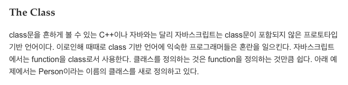
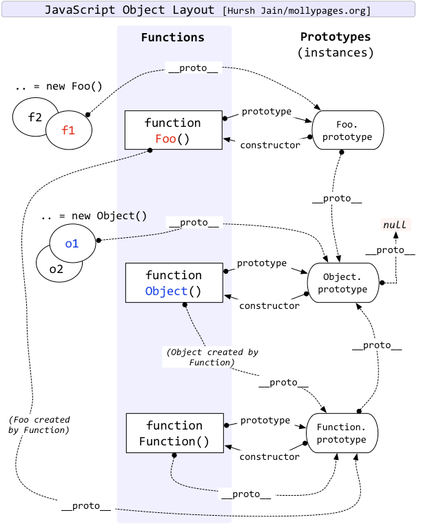

자바스크립트의 함수는 '객체 생성자' 로서의 역할을 할 수 있다. (아직은 그냥 콘솔 로그나 찍는 함수랑 constructor 로서 기능하는 함수 사이에 선언 시의 어떤 유의미한 차이가 있는 건지는 잘 모르겠다.) 아무튼, javascript 에서 객체를 만들때는 다음과 같이 한다. 다시 말해서 자바스크립트의 모든 객체는 그것을 만들어낼 수 있는 생성자를 가진다. 아래의 코드에서는 Foo 함수가 foo 객체를 만들어내는 객체 생성자가 된다.

```javascript
function Foo() {}
var foo = new Foo()
```

foo 는 Foo 라는 함수 (객체 생성자) 를 통해 새롭게 만들어진 객체이다. 만약 자바스크립트가 일반적인 객체 지향 언어였다면, 그리고 아직 이 글을 읽는 당신이 그렇게 생각하고 있다면 foo 는 인스턴스요 Foo 는 클래스 라고 생각할 것이다. 그러나 javascript 는 그렇지가 않다. 비슷하지만 미묘하게 다르고, 처음 접하는 사람에게는 굉장히 복잡할 수 있다.

Foo 라는 함수가 생성되면, 이 Foo 라는 함수는 'prototype' 이라는 프로퍼티를 가지게 된다. 그럼 이 프로퍼티는 무엇을 의미하느냐? 언제 쓰이느냐? 이후에 Foo 라는 함수(객체 생성자)를 통해 만들어질 객체는 모두 이 `Foo.prototype` 을 참고할 수 있다. 쉽다. 일반적인 객체 지향에서 쓰이는 클래스가 두가지로 쪼개어져 있다고 생각하면 좀 편하다. 인스턴스를 만드는 클래스와 인스턴스로부터 참조 받는 클래스. 인스턴스를 만드는 클래스는 Foo 라는 함수 그 자체인 것이고 인스턴스로부터 참조받는 클래스는 `Foo.prototype` 이 되는 것이다. 매우매우 쉽다!

​
(사실, `Foo.prototype` 에는 `constructor` 라는 프로퍼티가 있는데, 이는 Foo 함수를 가리킨다.)

​
function (생성자)를 클래스처럼 생각하면 된다는 이야기는 MDN 에도 적혀있다.



그렇다면 이제 새롭게 생성된 객체 foo 를 보자. 아까 "Foo 라는 함수(객체 생성자)를 통해 만들어질 객체는 모두 이 `Foo.prototype` 을 참고할 수 있다" 라고 했다. 어떻게 참조할까? 바로 `__proto__` 라는 프로퍼티를 통해 참조한다. `foo.__proto__` 는 Foo.prototype 과 연결된다. 즉 `__proto__` 프로퍼티는, 나를 만들어낸 함수 (객체 생성자) 의 prototype 을 가리키는 프로퍼티이다.

​
그리고 바로 이 대목에서 그 유명한 프로토타입 체인이 등장하게 된다. 프로토타입 체인은 '나한테 없는 프로퍼티를 요청받으면, 프로토타입 체인을 거슬러 올라가면서 해당 프로퍼티를 찾는 행위'에 사용된다. 이게 뭔 개소리냐고? 일단 foo 를 보자. 우리는 foo 에 아무런 프로퍼티도 할당해주지 않았다. 만약 foo 에 없는 프로퍼티를 요청한다면 어떻게 동작할까?

```javascript
function Foo() {}
Foo.prototype.hello = "hello, world!"
var foo = new Foo()

console.log(foo.hello) //hello, world!
```

아니 이게 어찌된 일일까. 나는 foo 에 hello 같은 프로퍼티는 추가해준 적이 없는데? 만약 foo 에 hello 라는 프로퍼티가 없다면, 자바스크립트 엔진은 `foo.__proto__` 에서 hello 를 찾는다. 그런데 아까 `__proto__` 가 뭐라 했더라? 나를 만들어낸 함수 (객체 생성자) 의 prototype 프로퍼티를 가리킨다 했다. foo 를 만든 함수는 누구지? Foo 이다. 즉 `foo.__proto__`는 `Foo.prototype` 을 가리킨다. 그런데 코드를 보니 Foo.prototype 에는 hello 라는 프로퍼티가 있다! 바로 이런 과정을 통해 foo.hello 는 'hello, world!' 가 되는 것이다. 이렇게 `__proto__` 를 거슬러 올라가는 걸 프로토타입 체인이라고 한다. 아주아주 쉽다!

​
그런데, 우리가

```javascript
function Foo() {}
```

이 구문을 입력할 때, `Foo.prototype` 어쩌고를 명시적으로 선언한 적이 있던가? 없다. 그럼 `Foo.prototype` 은 누가 만들었을까? 바로 Object 라는 함수 (객체 생성자) 이다. 여기서 검증 한 번. 당연히 Object 함수도 함수이기 때문에 prototype 이 있다. 그러면 다시 생각해보자. `Foo.prototype` 을 만든 함수 (객체 생성자)는 Object 이다. 그렇다면 `Foo.prototype.__proto__` 는 `Object.prototype` 을 가리킬 것이다. 과연 그럴까?

```javascript
Foo.prototype.__proto__ === Object.prototype //true
```

true 를 반환 했다. 못 믿겠다면 브라우저 콘솔을 켜든 node 를 켜든 해서 직접 해보자. 명백히 true다.

​
그렇다면 이번에는 Foo 함수 그 자체를 노려보자. Foo 는 함수이다. 그런데 이 함수는 누가 만들었는가? 우리가 만들었다. 우리는 이 함수를 어떻게 만들었는가? 바로 함수를 만드는 함수인 Function 함수 (객체 생성자) 를 통해서 만든 것이다! 분명히 우리는 Foo 앞에 function 이라는 단어를 붙여주었다. 이것을 통해 우리는 Function 이라는 함수 (객체 생성자)를 가져다 쓴 것이다.

​
잠깐 딴 소리를 하자면 위에서 function 이라는 키워드를 사용한 것 같이, 생성자를 통해 객체를 만들때는 꼭 new 를 사용하지 않아도 되는 몇가지 경우가 있다. (나도 다는 모른다)

```javascript
function Foo() {}
var Foo = new Function() //위와 동일

var bar = {}
var bar = new Object() //위와 동일
```

다시 하던 얘기로 돌아오자. 아무튼 Foo 라는 함수 (객체 생성자이자, 그 스스로도 이미 객체) 는 Function 이라는 함수 (객체 생성자) 를 통해 만들어졌다. 그렇다면 다시 `prototype` 과 `__proto__` 를 꺼내어보자. Foo 는 Function 을 통해 만들어졌다. 그렇다면 `Foo.__proto__` 는 `Function.prototype` 을 가리킬 것이다. 확인 들어갑니다.

```javascript
Foo.__proto__ === Function.prototype //true
```

좋다. true 가 나왔다. Foo 함수 (객체 생성자이자, 그 스스로도 이미 객체) 는 Function 이라는 함수 (객체 생성자)를 통해서 만들어진 것이다.

​
그럼 살짝 정리해보자.

1. Function 함수 (객체 생성자)를 이용해 Foo 라는 함수 (객체 생성자이자, 그 스스로도 이미 객체) 를 만들어 내었다. Foo.`__proto__` 는 Function.prototype 을 참조한다.​
2. 다음으로 Foo 함수 (객체 생성자이자, 그 스스로도 이미 객체) 를 이용하여 foo 객체를 만들어내었다. foo.`__proto__` 는 Foo.prototype 을 참조한다. (프로토타입 체인)
3. Foo.prototype 은 Object 함수 (객체 생성자)를 통해 만들어졌다. 우리가 직접 만든 것은 아니고, Function 함수 (객체 생성자)를 이용해 Foo 함수를 만들때 자동으로 생겼다. Foo.prototype 은 Object 함수 (객체 생성자)를 통해 만들어졌기 때문에, Foo.prototype.`__proto__` 는 Object.prototype 을 참조한다. (프로토타입 체인)

잠깐 프로토타입 체인을 살펴보자면 아래와 같다. 참고로 프로토타입 체인의 최상위에 존재하게 되는 Object.prototype 의 `__proto__` 는 null 이다. undefined 가 아닌 것에 유의!

```javascript
(foo.__proto__.__proto__ === Foo.prototype.__proto__) == Object.prototype
```

자 이제 Object 함수를 쳐다보자. 거의 다 왔으니 힘내자! Object 함수도 함수이자 객체이다. (사실 자바스크립트의 모든 것은 객체이다. 더 정확히는 배열이지만 그건 나중에 얘기하자.) 그렇다면 Object 함수를 만들어낸 생성자도 존재할 것이다. Object 함수를 만들어낸 생성자는 그렇다면 누구인가?

```javascript
Object.__proto__ === Function.prototype //true
```

이럴수가! Object 라는 함수도 결국 Function 에 의해 만들어진 놈에 불과했다!

​
그런데 나는 여기서 궁금증이 생기고 말았다. Function 이라는 함수도 결국 함수다. 다시 말해 결국 객체라는 이야기이다. 그렇다면 Function 도 그를 만들어낸 생성자가 존재한다는 말이 된다.

```javascript
Function.__proto__ === Function.prototype //true
```

맙소사, Function 은 Function 을 만들고 있었으며 Function 은 Function 에 의해 만들어지고 있었다.

---

만약 지금까지 내가 한 말이 전부 이해가 되었다면, 아래 그림도 아주 자연스럽게 이해할 수 있다.


