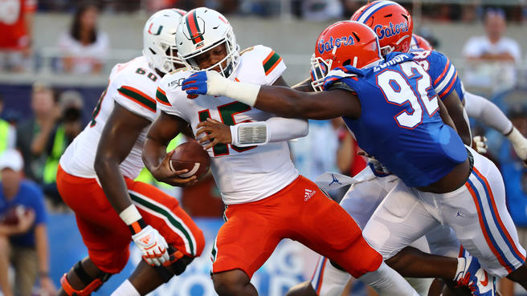

처음 슈퍼볼을 알게 된 건 고등학생 때였다. 물론 그 이전에도 미식축구의 존재 자체는 알고 있었지만, 직접 경기하는 모습을 본 적은 없었다. 어느 날인가 기숙사에 누워 여느 때처럼 놀고 있는데, 문득 슈퍼볼 경기가 보고 싶어 졌다. 유튜브에 NFL 을 치고 몇가지 영상을 보았다. 그때가 16년도 였으니 (수험생이었는데...) Denver Broncos 와 Seattle Seahawks 의 XLVIII 슈퍼볼이었다. 페이튼 매닝의 멋진 패스들을 보면서 나는 미식축구란 참 재밌는 스포츠라고 생각했고, 그 길로 몇가지 경기 영상들을 좀 더 찾아 보았다. 다양한 전략, 개인기, 무시무시한 선수들의 운동 능력까지, NFL 은 마치 작은 전쟁같았다.

우습게도, 다른 취미들이 그랬던 것처럼 나는 오래지 않아 미식축구를 잊어버렸고, 또 새로운 취미를 찾아다녔다. 아마도 대학교 1, 2학년에는 영화에 심취했었던 것 같다. '나는 영화를 좋아해' 라는 타이틀에 집착했던 것 같기도 하고, 정말 영화를 보는 것이 재밌었던 것 같기도 하다. 생각해보면 나는 예전부터 영화감독이 꿈이었다. 중학교 때 나왔던 나만의 영화 만들기 수행평가에 얼마나 많은 노력을 쏟아 부었었는지 아직도 기억이 난다. 밑도 끝도 없는 좀비물을 만들어놓고는 교실에서 그걸 틀었다니, 지금 생각하면 참 아찔하다. 그래도 촬영 / 편집을 모두 했던 그때만큼 가슴 뛰는 일을 해본 적이 별로 없다. 어쩌면 나는 정말 영화계로 갔어야 하는 걸지도 모른다.. ㅋㅋㅋ

최근에는 일이 바빠서 이런저런 취미들을 갖지 못했다. 좋아하는 영화도 안 본지 꽤 됐고, 넷플릭스도 도중에 끊어버렸다. 집에오면 인터넷이나 좀 보다 잠드는 게 끝이었으니, 그럴만도 하다. 기껏 그림 연습 하겠다고 사놓은 아이패드와 애플 펜슬은 용처를 잃고 그냥 유튜브 보는 물건이 되어버렸다. 심지어 귀찮은 나머지 애플 펜슬은 그냥 떼어놓고 쓰기도 한다. 운동도 한참을 안했다. 학교 다닐 때 했던 복싱도 이제는 하지 않으니 복싱 장갑은 그냥 방치되어 있다. 아마 저 옆에 보이는 짐 상자 안 어딘가에 처박혀 있을 테지. 사이드 프로젝트는 말 할 것도 없다. 한 두달 전 야심차게 기획해 보았던 파이프라인 UI 라이브러리는 결국 repo 를 날려버렸다. 뭘 어떻게 세팅 했었는지도 기억이 안나니 손을 댈 수가 없었다.

[hello](https://naver.com)
