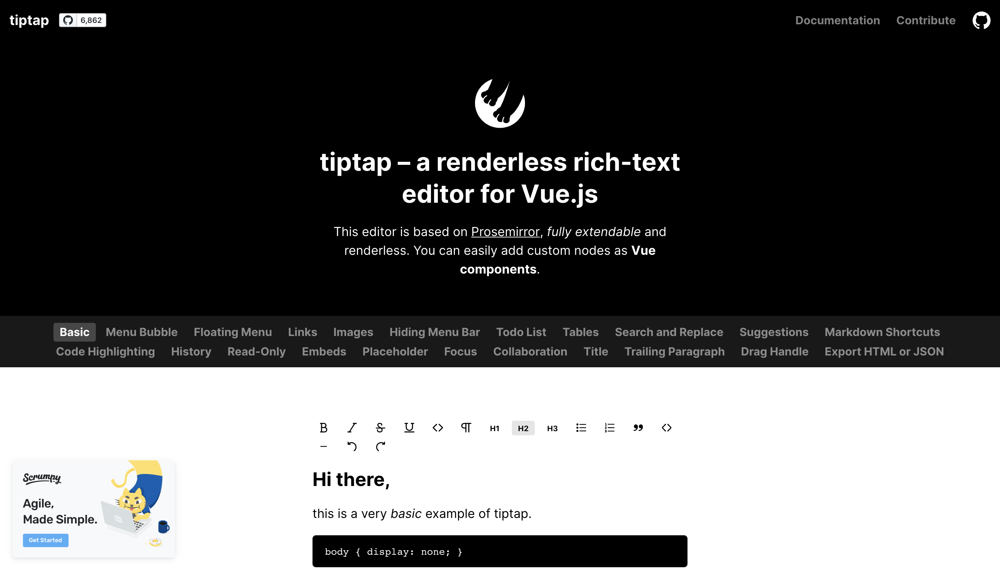
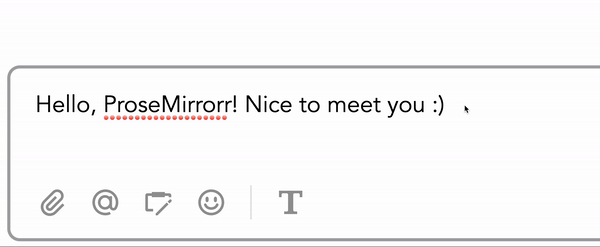

# Why

처음 ProseMirror 를 알게 된 건 작년 가을 쯤, 동아리 프로젝트를 진행하면서 였다. Vue 에서 쓸만한 Editor 라이브러리를 찾는 중이었는데 - 원래 쓰던 라이브러리는 deprecated 되어 있었으므로 - 마침 눈에 들어온 것이 tiptap 이라는 라이브러리였다. tiptap 은 ProseMirror 기반의 Vue 용 Wysiwyg Editor 라이브러리이다. 모듈화가 잘 되어 있고 기능도 다양한 편이라 사용하기 정말 좋았다. 특히 보통 이런 Wysiwyg 라이브러리들은 미리 만들어진 디자인 혹은 transition 등이 있는 편인데, tiptap 은 스타일링에 관여하지 않고 에디터 내부 컨텐츠의 조작에만 집중해주는 느낌이라 아주 마음에 들었다.



최근 회사에서 Wysiwyg 에디터를 만들게 되었는데, 그때 딱 생각났던 것이 이 tiptap 이었다. 물론 회사에서는 React 를 쓰고 있기 때문에 tiptap 을 그대로 쓸 수는 없었지만, tiptap 을 꽤 마음에 들어하면서 썼던 기억이 있었기 때문에 ProseMirror 를 사용해보자고 추천했다. 쟁쟁한 에디터 라이브러리들이 거론되었지만, 최후의 후보로 올랐던 것은 Quill 과 ProseMirror 였다. Quill 은 이미 Slack 등 많은 회사에서 사용하는 전례가 있었고 작업이 상대적으로 쉽다는 장점이 있었다. 코드도 많이 건드릴 필요 없이 모듈만 갖다 꽂으면 알아서 동작하니까. 반면 ProseMirror 는 API 가 너무 많고 문서 및 레퍼런스가 좀 적은 느낌이었지만, 그만큼 자유도가 매우 높다는 장점도 있었다.

ProseMirror 를 선택한 큰 이유는 두 가지 정도였던 것 같다. 첫번째는 Atlasian 이 ProseMirror 를 사용해 [꽤 걸출한 에디터](https://bitbucket.org/atlassian/atlaskit-mk-2/src/master/packages/editor/editor-core/)를 이미 만들었다는 것이었고, 두 번째는 Maintainer 의 전작인 CodeMirror 가 매우 괜찮은 물건이었기 때문이다(사실 CodeMirror 가 아니어도, [Author](https://marijnhaverbeke.nl/)의 라이브러리들은 검증된 것이 많다).

# What

ProseMirror 는 간단히 말하자면, Redux 처럼 State와 Action으로 관리되는 Text Editor 제작 툴이다. Quill 혹은 Draft 같은 다른 라이브러리와 살짝 느낌이 다른 지점이 있는데, 바로 API가 굉장히, 정말 굉장히 방대하다는 점이다. Reference 사이트의 길이가 무려 6만 3천 픽셀이다. 읽다보면 '뭐 이런 걸 다 만들어놨나' 싶은 API 들이 매우 많다. 물론 직접 개발하다보면, 왜 만들어놨는지 금방 이유를 알게 된다.

기본적으로 ProseMirror 는 세가지 정도로 구분할 수 있다. View, State, Transaction.

**View**

View는 DOM Ref를 받아서 에디터를 렌더링해주는 부분이다. 이 View 자체에 여러가지 Props 를 넘겨줄 수 있는데, 이 Props는 대부분 Transaction 과 맞물려서 특정 동작을 하기 전 / 후에 Side Effect 를 발생시키는 데 사용된다. 말고 딱히 특별할 건 별로 없는 편. dispatchTransaction 이라는 DirectProp 이 조금 특별한데, 이건 나중에 설명하도록 한다.

**State**

State는 현재 문서의 상태를 나타낸다. 커서의 위치, 내부 컨텐츠, 현재의 스키마 등 다양한 것을 포함하고 있다. 특히 스키마가 중요하다. 스키마는 이름에서 알 수 있듯이 현재의 State 가 표현할 수 있는 텍스트 Node 들을 정의해둔 것이다. 스키마를 작성하는 방법은 ProseMirror 문서에 친절하게 잘 설명되어 있으니 참고하는 것이 좋을 것 같다. State 는 스키마를 받아서, 스키마 기반으로 컨텐츠를 그리게 된다. 만약 스키마에 맞지 않는 텍스트가 입력되거나 하는 경우에는 입력이 무시된다. 물론 스키마 자체에 문제가 있다면 ProseMirror 에디터 자체에서 오류가 발생하니 스키마를 잘 짜는 것이 중요하다.

**Transaction**

Transaction은 Redux 의 액션과 같다고 생각하면 된다. state에 Transaction을 Dispatch 해주면 새로운 state가 반환된다. Transaction은 종류가 매우 다양하고 또 조합을 어떻게 하느냐에 따라 응용도 무궁무진하다.

이외에 Plugin 이라는 개념도 있는데, Plugin은 State에 붙어서 각종 Side Effect를 일으키는 작업을 한다. 예를 들어 내가 만든 Plugin 중에는 아래처럼 사용자가 텍스트 일부를 select 하면 그 위치에 작은 메뉴를 띄워주는 것이 있었다.



예시로 짧게 에디터를 만드는 코드를 작성하자면 아래와 같다.

```javascript
import { EditorView } from 'prosemirror-view'
import { EditorState } from 'prosemirror-state'
import { Schema } from 'prosemirror-model'

const schema = new Schema({
  nodes: ..., // Nodes' schema specs.
  marks: ..., // Markups' schema specs.
})

const editor = new EditorView(document.querySelector('#editor'), {
  state: EditorState.create({
    schema, // Schema for this Editor.
    plugins, // Plugins for this Editor.
  })
})
```

매우 간단하다. 스키마를 정의하고, EditorState를 만들고, EditorView를 이용해 렌더링한다. 이게 끝이다.

# How

물론 이 상태로는 아무런 기능이 없다. ProseMirror는 HTML의 [contenteditable attribute](https://developer.mozilla.org/ko/docs/Web/HTML/Global_attributes/contenteditable)를 이용하는데, 위와 같은 상태에서는 아무런 Plugin도 없고 transaction 조작도 없기 때문에, 그냥 HTML에 직접 contenteditable을 붙여둔 거나 똑같다. 이제 여기에 다양한 Plugin을 붙여서 원하는 기능을 만들어가면 된다.

실제로 존재하는 Plugin 중 하나인 inputRule을 살펴보자. inputRule은 prosemirror에서 자체적으로 제공하는 Plugin 중 하나로, Regex를 받아 해당 Regex와 일치하는 텍스트를 받았을 때 정해진 동작을 수행하는 Plugin이다. 사용법은 굉장히 쉽다.

```javascript
import { InputRule, inputRules } from "prosemirror-inputrules"

const arrowRule = new InputRule(/->/g, (state, match, start, end) => {
  console.log(match)
  return null
})

const inputRulesPlugin = inputRules({
  rules: [arrowRule],
})
```

inputRule은 Regex를 첫째 인자로 받고, 둘째 인자로 callback을 받는다. 이 callback이 Transaction을 반환할 경우 해당 inputRule은 작동한 것으로 판단되고, 다른 값을 반환할 경우 무시된다. 따라서 위의 inputRule은 매칭되는 텍스트를 콘솔에 출력하는 작동을 하고 있다고 보면 된다. 그리고 마지막으로 inputRules을 이용해 플러그인을 만들면 된다. 더 자세한 내용은 [ProseMirror 도큐먼트](https://prosemirror.net/docs/ref/#inputrules)에 써있다.

그렇다면 이 inputRule의 소스코드를 보자.

```javascript
export class InputRule {
  constructor(match, handler) {
    this.match = match
    this.handler = typeof handler == "string" ? stringHandler(handler) : handler
  }
}

export function inputRules({ rules }) {
  let plugin = new Plugin({
    state: {
      init() {
        return null
      },
      apply(tr, prev) {
        let stored = tr.getMeta(this)
        if (stored) return stored
        return tr.selectionSet || tr.docChanged ? null : prev
      },
    },

    props: {
      handleTextInput(view, from, to, text) {
        return run(view, from, to, text, rules, plugin)
      },
      handleDOMEvents: {
        compositionend: view => {
          setTimeout(() => {
            let { $cursor } = view.state.selection
            if ($cursor) run(view, $cursor.pos, $cursor.pos, "", rules, plugin)
          })
        },
      },
    },

    isInputRules: true,
  })
  return plugin
}

function run(view, from, to, text, rules, plugin) {
  if (view.composing) return false
  let state = view.state,
    $from = state.doc.resolve(from)
  if ($from.parent.type.spec.code) return false
  let textBefore =
    $from.parent.textBetween(
      Math.max(0, $from.parentOffset - MAX_MATCH),
      $from.parentOffset,
      null,
      "\ufffc"
    ) + text
  for (let i = 0; i < rules.length; i++) {
    let match = rules[i].match.exec(textBefore)
    let tr =
      match &&
      rules[i].handler(state, match, from - (match[0].length - text.length), to)
    if (!tr) continue
    view.dispatch(tr.setMeta(plugin, { transform: tr, from, to, text }))
    return true
  }
  return false
}
```

inputRules에서 새로운 Plugin을 생성할 때, props 중 handleTextInput에서 run을 실행하도록 했다. run은 받은 모든 rule을 돌면서 매칭되는 텍스트가 있는지 검사한다. 여기서 아이디어를 얻어야 하는 것은 바로 아래와 같은데,

1. Plugin은 다양한 Props를 가지고 있고, 각각의 Props는 state 혹은 state의 일부 값들을 인자로 받는다. 이를 이용해서 state에 다양한 조작을 취할 수 있게 된다. 특히 Props에 따라 boolean 을 return 하는 경우도 있는데, 이때 true 를 반환하게 되면 '어떤 Transaction이 본 Plugin을 통해 Side Effect를 발생시켰다' 라는 의미가 된다.
2. run 함수를 보면 알 수 있듯, state와 transaction에는 굉장히 다양한 methods 와 properties 가 있다. 이것을 잘 응용하는 것이 ProseMirror로 좋은 에디터를 만드는 관건이다. 실제로 나는 작업 시에 ProseMirror 문서를 켜두고, 내가 지금 필요로 하는 동작이 이미 API로 있지 않은지, 혹은 기존의 API를 적절히 조합하여 원하는 동작을 이끌어낼 수 있는지 항상 생각했다.

# Conclusion

Wysiwyg 는 정말 쉽지 않은 물건임이 분명하다. 일반적인 웹 개발과는 상당히 느낌이 다르고, 생각해야 할 엣지 케이스도 너무 많기 때문이다. ProseMirror는 이런 Wysiwyg를 좀 더 쉽게, 좀 더 정교하게 만들 수 있도록 도와주는 Framework이다 (스스로는 toolkit 이라고 설명하지만, 이정도면 Framework 이나 다름없다고 생각한다). 기회가 된다면 꼭 한 번쯤은 ProseMirror를 써봤으면 좋겠다. Wysiwyg 에디터를 만드는 것은 어려운 점도 많지만 그만큼 매력적인 부분도 많은 작업이고, 특히 ProseMirror는 하나씩 쌓아올려가는 듯한 느낌이 드는 재밌는 라이브러리이기 때문이다.
