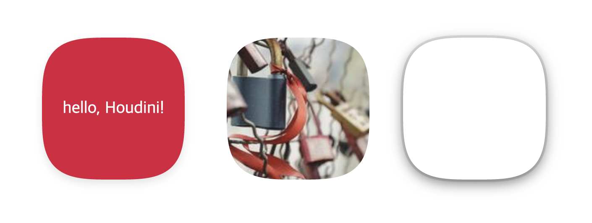
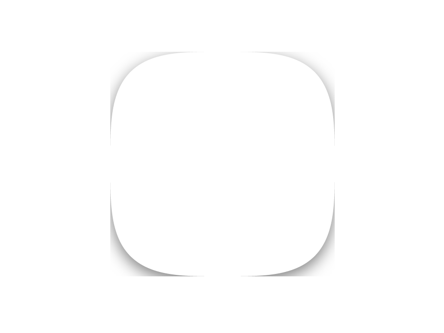
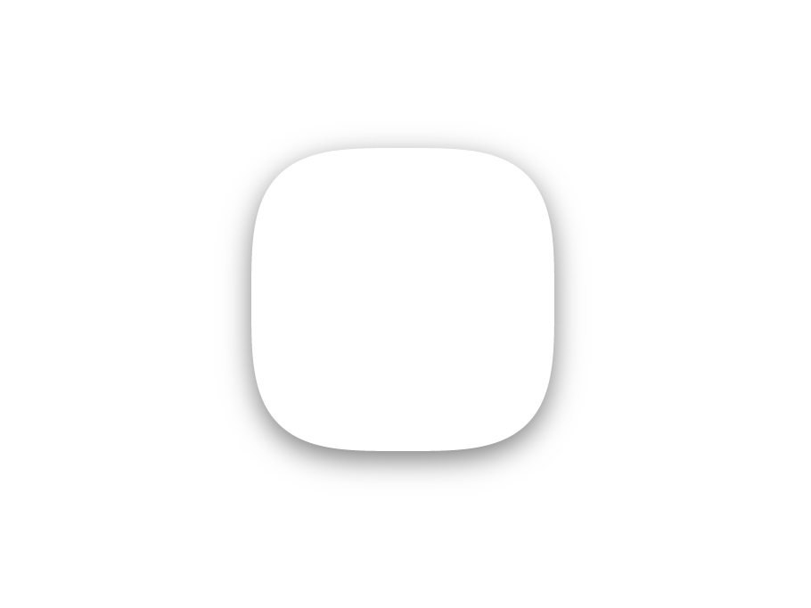
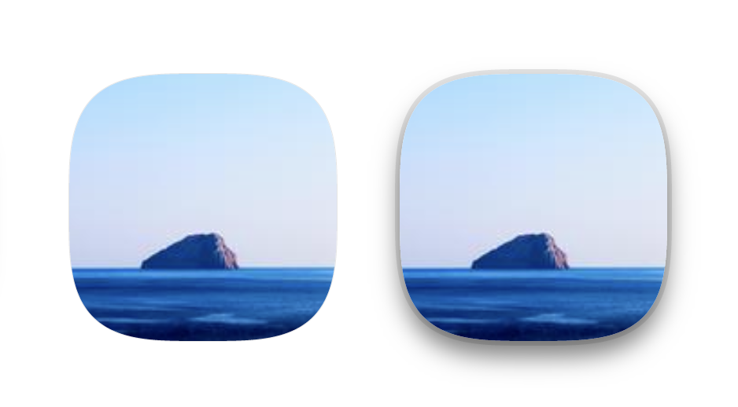

# Why
여기, 어떤 코드가 있다. 이 코드는 규칙도 매우 느슨하고, 에러가 발생하지도 않으며, 디버깅할 수 있는 툴도 없다. 오로지 결과를 보고 코드를 역추적해서 문제를 해결해야만 한다. 이걸로 끝일까? 심지어 이 코드는 환경에 따라서 동작이 달라진다. 잘 동작하던 코드가 다른 환경으로 옮겨가면 엉뚱한 결과를 내뱉기도 하고, 아예 동작할 수 없는 코드가 되기도 한다. 이걸로도 만족할 수 없다면, 이 코드는 새로운 기술이 나오기까지 7년(!)까지도 걸리고, 새로 발표된 기술을 미리 쓰기 위해 잡다한 트윅까지 해야 한다면 어떤가? 과연 이딴 물건을 쓰고 싶은가? 도대체 이런 걸 쓰는 사람이 있을까?

정답은 '있다'이다. 지금 보고 있는 이 문서도 위의 코드를 이용해 작성되었다. CSS 는 정말 어렵다. 브라우저마다 동작이 다르고, 원하지 않는 결과가 나오더라도 아무런 에러도 경고도 없으며, import 는 아직도 IE 에 없다. 웹 개발자에겐 CSS 에 대한 견고한 rule 과 확장 가능한 API 가 필요하다. 상상해보라, 당신이 원하는 CSS Property 를 만드는 모습을.

CSS Houdini 는 이러한 요구에 응해 탄생한 API 의 모음이다. CSS Typed OM, Paint API, Layout API 등 다양한 API 가 당신의 CSS 를 돕기 위해 나와있다. 물론, 새로운 웹 기술이라는게 그렇듯이, 아직 모든 브라우저에서 쓸 수는 없다. 현재는 Chromium 기반의 Chrome, Edge, Opera 에서만 쓸 수 있다. 그것도 Typed OM 과 Paint API, Properties 만 쓸 수 있다. 이 글에서는 Paint API 의 사용법을 중점적으로 살펴보면서 Houdini APIs 의 강력함을 알아보려고 한다.

# What
CSS Houdini 는 여러 개의 API 집합이다. 이 중 Parser API 와 Layout API 는 아직 Draft 단계이며 사용가능한 브라우저가 없으므로, Chrome 에서 테스트 가능한 3가지를 간략하게 설명해본다: **CSS Properties and Value API**, **Paint API**, 그리고 **CSS Typed OM**.

## CSS Properties and Value API
아마도 CSS Houdini 의 API 중 가장 간단할 것이다. Custom Property 에 문법, 상속, 초기값 등 더 상세한 설정이 가능해진다.
```js
CSS.registerProperty({
  name: '--awesome-houdini',
  syntax: '<string>',
  inherits: false,
  initialValue: 'hello, world!',
})
```

## Typed OM
아래와 같은 코드를 보거나 작성한 기억이 있을 것이다.
```js
element.style = 'width: 100%; height: 50%;'
```
JS 에서 css property 와 value 는 모두 stirng 처럼 취급되고 관리된다. string 은 타입 정의도 없고 에러도 발생시키지 않는다. 이런 어려움을 해결하기 위해, CSS Value 를 타입이 정의된 object 로 제공하는 것이 CSS Typed OM (Object Model) 의 취지이다. 타입은 `CSSStyleValue` 와 이를 상속한 `CSSNumericValue`, `CSSImageValue` 등이 있다.

사용법은 간단하다. DOM reference 의 `computedStyleMap` 으로 Typed OM 객체를 얻고, `get` 으로 원하는 property 의 값을 뽑아내면 된다.
```html
<body>
  <h1 id="hello, world">타겟</h1>
<body>
```
```js
const element = document.getElementById('hello, world')
const styleMap = element.computedStyleMap() // StylePropertyMapReadOnly
const fontSize = styleMap.get('font-size') // CSSUnitValue(...)
```
새로운 CSS Value 를 만들때는 `CSSStyleValue.parse` 메소드를 활용한다. 이 메소드는 새로운 Value 를 만들거나, `CSSUnparsedValue`를 특정 타입으로 캐스팅할 때 활용할 수 있다. `CSSUnparsedValue` 는 custom property 의 타입이며, unit이나 number 등 어떤 값도 가질 수 있기 때문에 초기 값은 UnparsedValue 로 되어 있다.
```js
const customFontSize = styleMap.get('--custom-font-size') // CSSUnparsedValue
const newFontSize = CSSUnitValue.parse(customFontSize) // CSSUnitValue
```
## Paint API
사실 오늘 이 글을 작성한 이유는 Paint API 를 소개하기 위함이었다. 위의 두 API 가 CSS 에 타입을 정의하고 활용할 수 있도록 도와주었다면, Paint API는 **정말로** 새로운 CSS 스타일링을 만들 수 있도록 도와주는 API 이다. 복잡하게 설명하는 것보다, 직접 해보면서 이해하는 것이 빠르다. 오늘 Paint API 로 만들어볼 것은 다음 도형이다.



일반적인 border-radius 와는 조금 다른 로직으로 구현된, Smooth corners 라는 효과이다. 간단한 예시가 [여기](https://css-houdini.rocks/smooth-corners)에 적혀있지만, 이곳의 예시는 그림자를 표현할 수 없고 직사각형이 만들어지지 않는다는 문제가 있었다. 그래서 [smooth-corners](https://github.com/wopian/smooth-corners) 패키지를 참고하여, 더 다양한 기능을 할 수 있는 smooth corners 를 만들어보고자 한다. 완성된 코드는 [여기](https://github.com/jwoo0122/awesome-smooth-corners)에서 확인할 수 있다.

# How
그럼 CSS Houdini를 직접 써보자. 준비물은 Chromium(Blink) 기반의 최신 웹 브라우저와 간단한 코드 에디터이다.

먼저 Paint API 의 기본적인 사용법을 알아야 한다. 3단계로 구성되어 있다.
1. paintWorklet 모듈을 작성한다. (Javascript)
2. 이를 CSS.paintWorkelt 에 등록한다.
3. css 에서 paint() 함수를 이용해 해당 worklet 을 사용한다.
smooth corners 구현을 위한 접근법은 두 개가 있다. 하나는 mask-image 를 사용해 그림을 masking 하는 것이고, 다른 하나는 background 를 활용해 배경에 직접 도형을 그려주는 것이다. 전자는 쉽게 배경 그림을 넣을 수 있고 또 overflow-hidden 효과가 자동으로 적용된다는 장점이 있다. 하지만 나는 shadow 가 정말 필요했고, mask-image 에서 추가적인 DOM 없이 shadow 를 구현하는 방법은 끝까지 찾지 못했다. 그래서 background 를 이용하기로 결정했다.

여담이지만, DOM 이 추가되어도 상관없다면 mask-image 와 shadow 를 한 번에 취할 수 있다. [이런 접근법](https://stackoverflow.com/questions/12492006/box-shadow-on-element-with-webkit-mask-image)을 참고해보자.

## Create paintWorklet
paintWorklet 을 작성해보자. paint 를 사용하기 위해서는 우선 해당 paint 에 맞는 worklet 이 필요하다.
```js
CSS.paintWorklet.addModule('paint.js')
```
여기서 addModule 에 필요한 모듈의 주소는 Worker 를 등록할때와 동일한 방식으로 resolve 된다. 따라서 Webpack 등의 번들러로 이를 구현할 때는 특별한 Loader 가 따로 필요하다. 참고: [worklet-loader(Webpack)](https://www.npmjs.com/package/worklet-loader)

이번엔 진짜 worklet 모듈을 작성해보자. 모듈은 canvas 와 비슷한 PaintRendeingContext2D 를 이용하는 `class` 하나와 `registerPaint` 함수 하나로 구성된다.
```js
class SmoothCorners {...}

registerPaint('smooth-corners', SmoothCorners)
```
`registerPaint`의 첫 arg 로 넘겨준 `smooth-corners`가 해당 속성을 paint 로 사용할 때 필요한 이름이 된다.
```css
#element {
  background: paint(smooth-corners);
}
```

## Implement superellipse
하지만 이렇게는 아무런 일도 일어나지 않는다. 지금부터 필요한 것은 `SmoothCorners` class 를 작성하는 것이다. Worklet class 에 사용되는 두 가지를 구현해보자: `inputProperties` getter, `paint` method.
```js
class SmoothCorners {
  static get inputProperties() {
    return [
      '--smooth-corners',
    ]
  }

  paint(ctx, geom, properties) {
    ...
  }
}
```
`inputProperties`는 해당 Worklet 이 사용할 css property 의 모음을 가리킨다. 우선은 아주 간단하게 `--smooth-corners`를 사용하는 Worklet을 작성해보기로 한다.

paint는 실제로 화면에 그릴 Raster Image를 생성하는 method이다. 첫번째 params는 PaintRenderingContext2D로, CanvasRendringContext2D와 거의 똑같다. 한가지 차이점이라면 canvas element를 가리키는 `canvas` 속성이 없다는 정도이다. 이건 실제 Canvas가 아니니까.

이제 ctx 를 활용해서 실제 smooth-corners 도형을 그릴 차례이다. 이 Smooth Corners 라는 도형은 사실 [SuperEllipse(초타원)](https://en.wikipedia.org/wiki/Superellipse)이다. 고등학교에서 배우는 타원의 좀 더 일반화된 정의라고 생각하면 쉽다. 문서를 참조하면 알 수 있겠지만, x와 y에 대한 지수(n)이 높아질 수록 면적이 넓은 방향으로 나아가는 것을 볼 수 있다. 우리는 `--smooth-corners` property로 이 n을 받도록 한다.

이제 필요한 것은 각 t 와 축의 길이 a, b 에 대하여 x 와 y 의 좌표를 표현해내는 것이다. 이것은 수학적으로 꽤 복잡할 수 있는데, 다행히 나는 이것을 멋지게 풀어낸 [패키지](https://github.com/wopian/smooth-corners)를 발견했다. 여기의 수식을 응용하여 Superellipse를 표현하는 메서드를 작성해보자.
```js
class SmoothCorners {
  static get inputProperties() {...}

  superellipse(a, b, nX, nY) {
    if (nX > 100) nX = 100
    if (nY > 100) nY = 100
    if (nX < 0.00000000001) nX = 0.00000000001
    if (nY < 0.00000000001) nY = 0.00000000001
    const nX2 = 2 / nX
    const nY2 = 2 / nY
    const steps = 360
    const step = (2 * Math.PI) / steps
    const points = t => {
      const cosT = Math.cos(t)
      const sinT = Math.sin(t)
      return {
        x: Math.abs(cosT) ** nX2 * a * Math.sign(cosT),
        y: Math.abs(sinT) ** nY2 * b * Math.sign(sinT)
      }
    }
    return Array.from({ length: steps + 1 }, (_, i) => points(i * step))
  }

  paint(ctx, geom, properties) {...}
}
```
`superellipse` 함수는 각 축의 길이와 축에 따른 n을 받아서 x, y 좌표에 대한 Array를 반환한다. 이를 paint 에서 활용해서 초타원을 그리면 된다.
```js
paint(ctx, geom, properties) {
  const nX = properties
    .get('--smooth-corners')
    .toString()

  const ratio = geom.height / geon.width

  const nY = nX * ratio

  const smooth = this.superellipse(
    geom.width / 2,
    geom.height / 2,
    nX,
    nX,
  )

  ctx.setTransform(1, 0, 0, 1, geom.width / 2, geom.height / 2)
  ctx.beginPath()

  smooth.forEach(({ x, y }, index) => {
    if (index === 0) {
      ctx.moveTo(x, y)
    } else {
      ctx.lineTo(x, y)
    }
  })

  ctx.closePath()
}
```
geom은 worklet이 적용되는 DOM element에 대한 정보가 담겨있다. properties는 위에서 Typed OM 에 대해 설명할 때 만났던 `StylePropertyMapReadOnly` 객체로, 이를 통해 CSS value 에 접근할 수 있다. `--smooth-corners`는 custom property이기 때문에 `CSSUnparsedValue` 타입을 갖는다. 이를 활용하려면 `CSSStyleValue.parse`를 이용하면 되지만, 이상하게도 Worklet 안에서는 모든 Typed OM의 parse 메서드가 `undefined`로 취급된다. 이유는 잘 모르겠지만, 아무튼 이런 이슈 때문에 하는 수 없이 `toString`을 사용했다.

## Color, Image, Shadow
이상의 작업이 끝나면 아주아주 기초적인 작업을 마친 것이다. 하지만 이걸로는 아무런 효과가 없다. 배경색도, 그림자도, 테두리도 없기 때문이다. 두 가지만 기억하면 된다. 첫째, properties로부터 원하는 CSSStyleValue를 가져올 것. 둘째, canvas API를 사용하는 것과 동일하게 이미지를 그릴 것. paint API는 생각보다 쉽다.
```js
paint(ctx, geom, properties) {
  ...
  const backgroundColor = properties
    .get('--smooth-corners-bg-color')
    .toString()
  ...
  ctx.fillStyle = backgroundColor
  ...
  ctx.fill()
  ctx.closePath()
}

```
이걸로 매우 쉽게 backgroundColor를 구현할 수 있다. shadow, border도 마찬가지로 구현할 수 있다. 샘플 repository의 코드에는 border 를 `blur: 0; spread: ${n}px;`인 box-shadow로 받는 Worklet이 들어있다.

shadow를 구현할 때 조금 신경써야 하는 부분이 있다. 만약 그냥 ctx 에 shadow style 을 적용하고 보면, 아마도 아래처럼 보일 것이다.



이는 background image가 element보다 크게 그려질 수 없기 때문이다. 그렇기에 약간의 편법을 활용해야 하는데,
1. 실제 element 보다 Superellipse를 더 작게 그리고 (shadow의 blur 값보다 두배 만큼, 위쪽 아래쪽으로 여백을 제공해야 하므로)
2. element 에 padding 을 주어서 작아진 superellipse 만큼 element의 크기를 늘리고
3. 그렇게 늘어난 element 크기만큼 반대로 음수의 margin을 주어서, 실제로 보이는 영역을 원래대로 되돌리는 것이다.

코드로 보면 아래와 같다.
```css
#element {
  --smooth-corners: 3.5;
  --smooth-corners-shadow: 0 5px 15px 0 rgba(0, 0, 0, 0.1);
  --smooth-corners-padding: 30; /* 위에서 shadow의 blur 값이 15였으므로 이의 2배를 제공한다. */

  padding: 30px;
  margin: -30px; /* 이렇게 하면 margin: 0와 같은 효과이다. 이를 가감함으로서 margin 효과를 적용할 수 있다. */
}
```
```js
class SmoothCorners {
  static get inputProperties() {
    return [
      ...
      '--smooth-corners-padding',
      ...
    ]
  }

  superellipse(a, b, nX, nY) {...}

  paint(ctx, geom, properties) {
    ...
    const padding = properties
      .get('--smooth-corners-padding')
      .toString()
    ...
    const smooth = this.superellipse(
      (geom.width / 2) - padding,
      (geom.height / 2) - padding,
      nX,
      nY,
    )
    ...
  }
}
```
이렇게 하면 더 이상 그림자가 잘리지 않는다. 썩 마음에 들지 않는 코드일지는 몰라도, *어쨌든* 그림자를 보여줄 수 있다.



마지막으로 배경에 이미지를 넣는 방법을 알아보자. `mask-image: paint(...)` 속성을 사용한다면 배경 이미지는 그냥 으레 하듯이 `background-image`로 설정하면 끝이라서 난이도가 급격하게 내려가지만, `background: paint(...)`를 이용하기로 결정했다면 `background-image`를 사용할 수 없기 때문에 어려워진다. 이유를 차근차근 설명해보겠다.

우선 첫번째로, 배경에 이미지를 삽입하기 위해서는 `ctx.drawImage`가 필요하다. 둘째, `drawImage`는 `CSSImageValue`, 혹은 `HTMLElement` 중에서도 이미지를 포함하는 img, video 등의 엘리먼트, 혹은 다른 `canvas`를 인자로 받는다. 셋째, Worklet 안에서는 Web Worker와 마찬가지로(이쪽은 `postMessage`로 우회하는 방법이 있긴 하지만) global window 객체에 접근할 수 없고, 따라서 `new Image()` 생성자나 `document.createElement` 등의 함수는 사용할 수 없다. 넷째, custom property는 언제나 CSSUnparedValue를 갖는다. 마지막으로, Worklet 안에서는 `CSSStyleValue.parse`를 사용할 수 없다. (마지막 이유의 근본적인 원인은 나도 모르겠다, 구현 상의 버그일 지도?)

이러한 특성이 모여서 아주 골때리는 상황이 된다. 우리는 이미지를 그리기 위해서 `CSSImageValue`혹은 `Image`객체가 필요한데, custom property를 이용해서는 이를 얻어올 방법이 없는 것이다. custom property 의 unparsed 값을 image 값으로 변환할 수도 없고, Image 객체를 임의로 직접 만들 수도 없다. 그래서 나는 영리하다면 영리하고 위험하다면 위험한 방법으로 이를 우회하기로 결정했다. 바로 **거의 사용하지 않는, `<image>`를 받는 property를 사용하는 것**이다.
```js
class SmoothCorners {
  static get inputProperties() {
    return [
      'border-image-source', // 솔직히 잘 안쓰잖아?
      ...
    ]
  }

  superellipse(...) {...}

  paint(ctx, geom, properties) {
    ...
    const backgroundImage = properties
      .get('border-image-source') // CSSImageValue

    ...

    if (backgroundImage) { // 사실 이 조건은 좀 더 정교하게 작성될 필요가 있다.
      ctx.drawImage(backgroundImage)
    }
    ...
  }
}
```
```css
#element {
  border-image-source: url('../path/to/image');

  --smooth-corners: 3.5;
  --smooth-corners-bg-shadow: 0 0 0 1px rgba(0, 0, 0, 0.1), 0 5px 15px 0 rgba(0, 0, 0, 0.1);
  --smooth-corners-padding: 30;
}
```
정말 내가 원하는 방향이 아니지만, 배경사진을 구현하기 위해서는 지금까지는 이 방법밖에 없는 듯 하다. 딱히 이걸 구현한 사람이 없기도 하고. 추가로, 이 구현은 배경 이미지와 그림자를 동시에 사용해도 된다.



# Conclusion
이렇게 CSS Houdini를 간단하게 알아보았다. 회사에서 작업하던 도중 Smooth Corner 디자인이 필요해서 리서치를 하다가, CSS Houdini는 정말 강력한 API가 될 것이라는 생각이 들어 글을 쓰게 되었다. Web Component, CSS houdini는 웹 개발자에게 더 많은 가능성을 약속한다. MDN의 태그 문서, CSS property polyfill을 뒤져보는 수고를 줄이고, 창의적이고 다채로운 컴포넌트와 스타일을 고민하는데 더 많은 시간을 쏟을 수 있게 된다.

다만 주의할 점은, 아직 모든 API 가 전부 구현된 것은 아니다. MDN 문서도 부실한 부분이 있으며, 브라우저 별로도 지원 현황이 다르다. [여기](https://ishoudinireadyyet.com)에서 브라우저 별 지원 현황을 확인할 수 있다. paint API 를 위한 [polyfill](https://github.com/GoogleChromeLabs/css-paint-polyfill) 이 존재하기는 하지만, 어쨌든 지금 production에서 공격적으로 사용하기에는 시기상조라는 생각이 든다. 위의 예제만 봐도 알겠지만 코드에 임시적이고 위험한 부분들이 많다. 지원하는 브라우저가 늘어나고 다양한 예제가 생기면 정말 필드에서 사용할 수 있게 될 것이다.

오늘 글은 최대한 practical 한 Houdini의 사용법을 알아보았다. 추후 기회가 된다면 Layout API, Animation API 등도 더 다뤄보고 싶다. 언젠가는 React, CSS in JS 등의 프레임워크와 라이브러리에서 벗어나 브라우저 표준 스펙만으로 웹 앱을 만드는 시대가 올 지도 모르겠다.

끝으로, [채널톡](https://channel.io/ko)은 CSS Houdini 같은 최신 웹 기술을 바탕으로 대규모 웹 앱을 개발하고 있다. 도전적인 과제와 함께 성장할 수 있는 기회가 늘 열려있다. 웹 프론트엔드 개발자로서 다양한 주제에 부딫혀 보고 싶다면, 주저말고 [지원](https://channel.io/ko/jobs)해보길 바란다.

# Reference
- [Smooth corners with CSS Houdini, @iamvdo](http://iamvdo.me/en/blog/smooth-corners-with-css-houdini) - `mask-image`로 smooth corners 를 구현하는 방법이 소개되어 있다.
- [Houdini Spellbook, @snugug](http://houdini.glitch.me) - Practical한 예제들이 많다. 매우 유용함.
- [awesome-css-houdini, Github](https://github.com/CSSHoudini/awesome-css-houdini) - 개인이 모아둔 CSS Houdini 관련 읽어보면 좋은 글 모음이다.
- [CSS Houdini, MDN](https://developer.mozilla.org/en-US/docs/Web/Houdini)

모든 종류의 피드백은 언제나 환영합니다.
